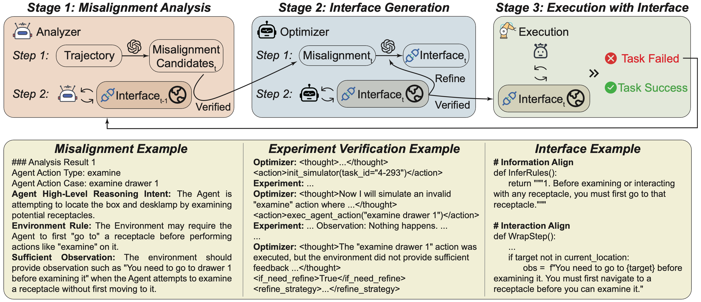
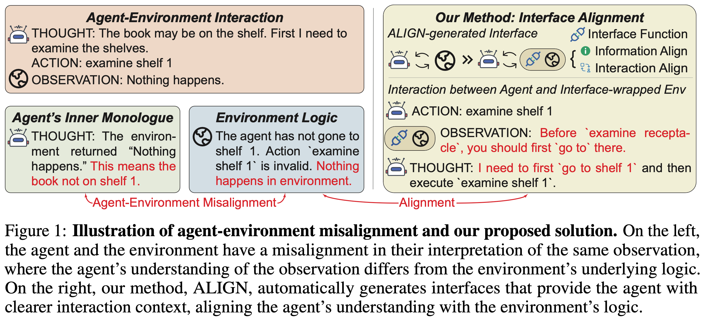
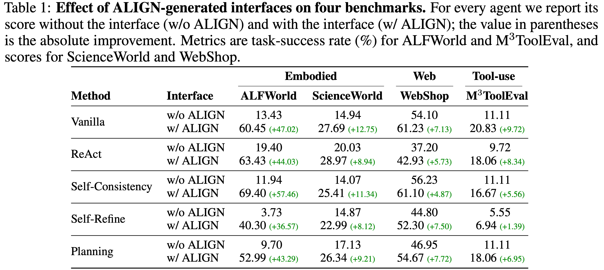

# ALIGN: Agent‑Environment Alignment via Automated Interface Generation



---

## 🔍 What is ALIGN?

Large‑language‑model (LLM) agents often fail because their *interfaces* (the action & observation layer that sits between the agent and the environment) neglect to reveal hidden pre‑conditions or constraints.  **ALIGN** is a system that **automatically generates a richer, better‑aligned interface** without touching either the agent logic *or* the environment code.

<!-- <div align="center">

</div> -->


### Key Contributions

1. **Problem Identification**: We show that *agent‑environment misalignment* is a major, previously under‑explored bottleneck across embodied, web‑navigation, and tool‑use domains.
2. **Auto‑Aligned Interface Generation**: `InferRules` (static rules) + `WrapStep` (dynamic observations) are synthesized by an LLM‑powered *Analyzer* and *Optimizer* with on‑the‑fly experimental verification.
3. **Plug‑and‑Play**: Implemented as a lightweight Python wrapper; *no* environment rewrite, *no* agent fine-tune.
4. **Strong & General Improvements** – Up to **+45.67 %** absolute success‑rate gain on ALFWorld and consistent boosts on ScienceWorld, WebShop, and M3ToolEval. Gains transfer **across agents** and **across LLM backbones**.

---

## ✨ Results



---

## ✏️ Citing ALIGN

If you find this work useful, please cite:

```bibtex
@misc{liu2025agentenvironmentalignmentautomatedinterface,
      title={Agent-Environment Alignment via Automated Interface Generation}, 
      author={Kaiming Liu and Xuanyu Lei and Ziyue Wang and Peng Li and Yang Liu},
      year={2025},
      eprint={2505.21055},
      archivePrefix={arXiv},
      primaryClass={cs.AI},
      url={https://arxiv.org/abs/2505.21055}, 
}
```

---

## 💬 Contact & Questions

Open an issue or reach us at `chatkming@gmail.com`.

Enjoy and happy aligning! 🎉
